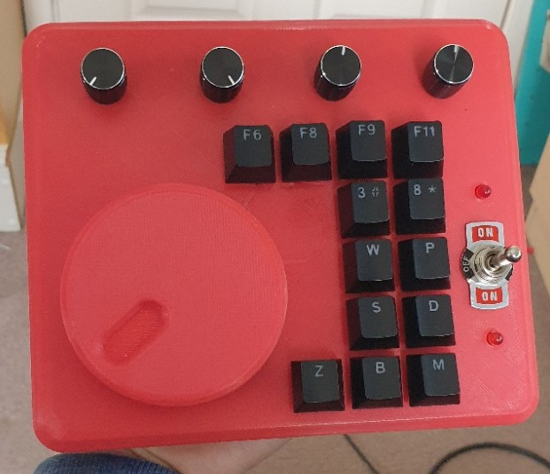

# Macropad

## What is it?
This is a small USB Keyboard with rotary encoders designed to have shortcuts assigned to them

It consists of a 3D printed enclosure with 4 Dials, 1 Big Wheel and 13 Mechanical KeySwitches. It also has a 3-Way Switch to switch between button layers. Its powered by a Teensy 4.0 (First time using a teensy and I am hooked)
## WTF was the warning in the description
I don't know what I'm doing. My code works, but it's not written in a way that is particularly understandable. the same applies for my 3D models, I haven't modelled this in a way that's easy to modify. It works enough for me. This project was designed for me to use and no-one else. The only reason this repository exists is a place to store the code. You can do with this how you want. Just be warned.
## Main Principal
The Macropad is recognised by the PC as a keyboard+mouse+joystick+serial device. The buttons on the Macropad output an f13-f24 keypress. Autohotkey listens for these keypresses and outputs the appropriate shortcut. I also added a 3-way switch to the Macropad so you can have different layers to the macros. I use the Serial output as a method of debugging, whenever you press a key, It outputs the letter assigned to the key and the current mode of the 3-Way switch (I know having an open Serial debug interface is a security risk, but it's a keyboard so whatever)
## Precompiled Firmware
I included the precompiled firmware I'm using alongside the source-code. The Firmware.hex is okay, however you might want to change the media keybindings. You almost definitly want to customise the autohotkey script (also both precompiled and Source-code available) since most keys open programs that I use often but most people will have never heard of (e.g. Cura) and the key set to output your email address just prints [EMAIL1] since I'm not sharing my personal email addresses (duh).
## Installing Precompiled Firmware
If for some unholy reason you want to use my precompiled firmware, here it is:
#### Macropad:
  1. Download [Teensy Loader](https://www.pjrc.com/teensy/teensy.exe)
  2. Download Firmware.hex from the Firmware directory
  3. Open Teensy Loader
  4. File/Open HEX file
  5. Press program button on teensy
  6. Press Upload
  7. DONE (LEDs should flash when powered on)
#### Windows:
  1. Win+R
  2. Run "shell:startup"
  3. Copy Macropad.exe into the folder
  4. DONE
## Test Firmware
When I was wiring the Macropad, I wanted to test the connections so I made a test program that just spits out sensor values over serial so they can be read by software like PuTTY or Arduino IDE. This helps find hardware issues with the Button Matrix and Rotary Encoders. Since I haven't uploaded wiring diagrams yet it probably isn't too useful
## Parts List
- 1x Big Wheel.stl
- 1x Top.stl
- 1x Holding Plate.stl
- 1x Base.stl
- 5x KY-040 Rotary encoders
- 1x 3-Way Switch
- 1x Teensy 4.0
- 13x Mechanical Keyswitch (I used Cherry MX Blue)
- 13x 1N4148 Diodes
- 13x Keycaps
- 7x Self Tapping Screws
- Thin insulated wire
- 2x LED
- 2x 200 Ohm Resistors
